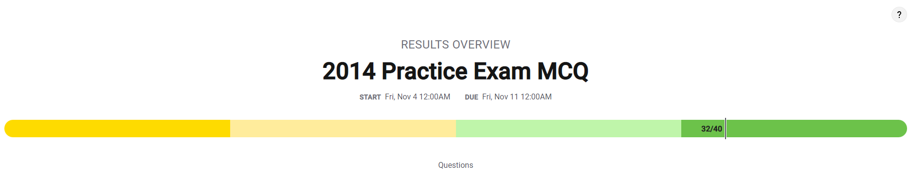
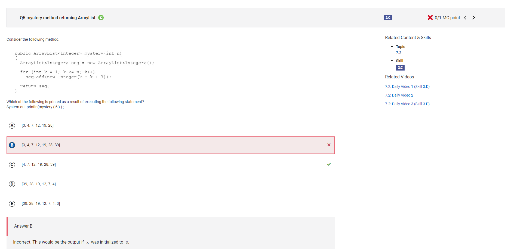
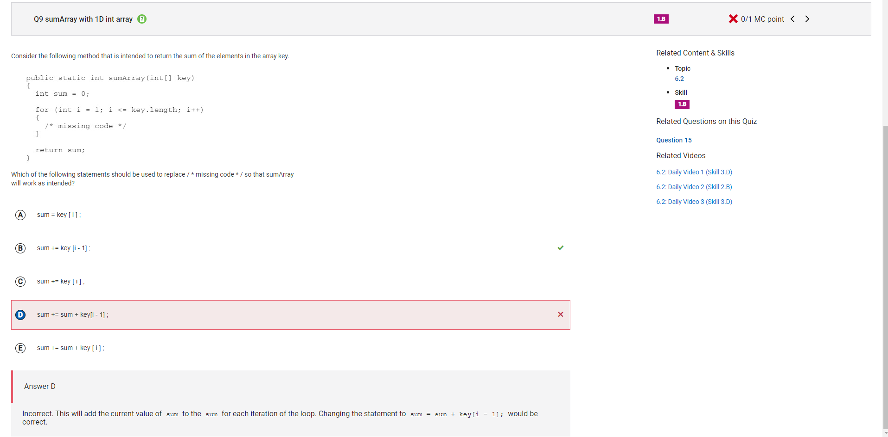
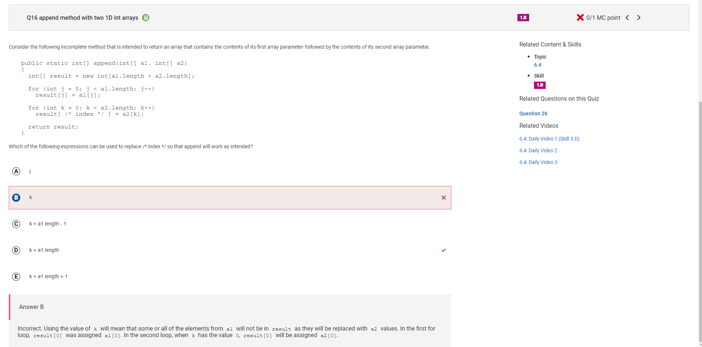
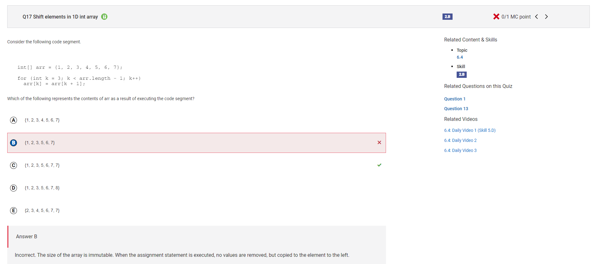
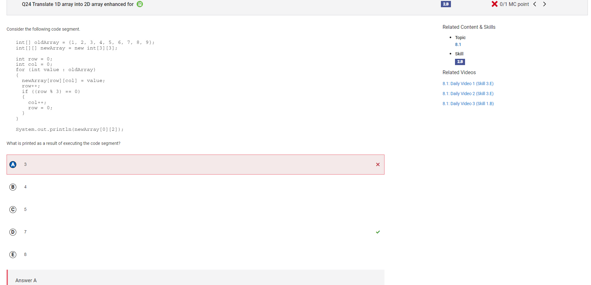
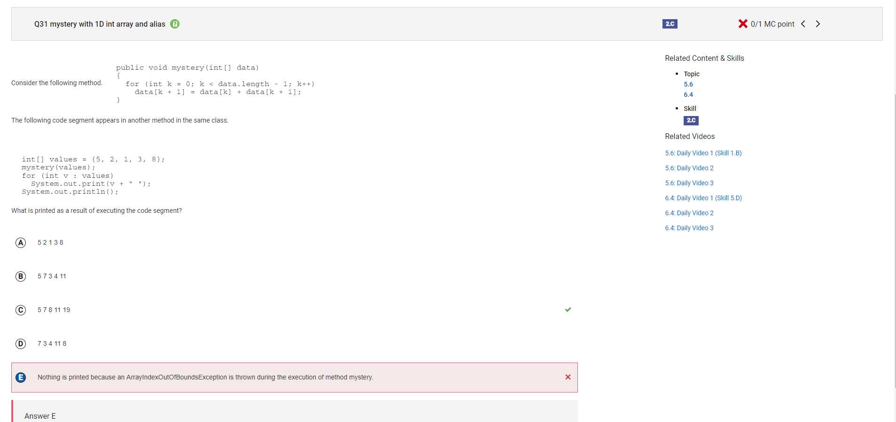
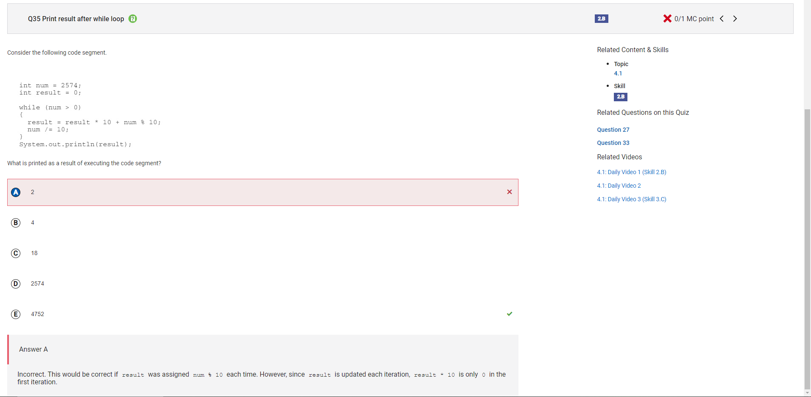
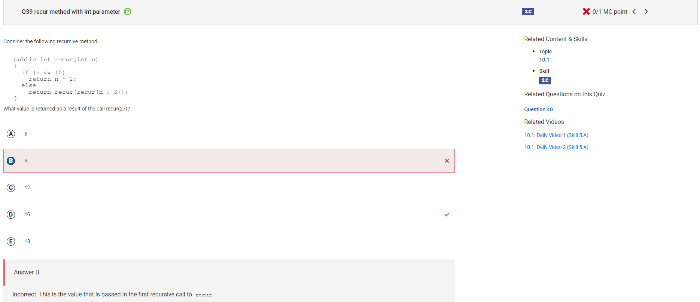

Homework

[Unit 1](https://peacekeeper6.github.io/fastpages/java/2022/11/09/unit1-hw.html)
[Unit 2](https://peacekeeper6.github.io/fastpages/java/2022/11/09/unit2-hw.html)
[Unit 3](https://peacekeeper6.github.io/fastpages/java/2022/11/09/unit3-hw.html)
[Unit 4](https://peacekeeper6.github.io/fastpages/java/2022/11/09/unit4-hw.html)
[Unit 5](https://peacekeeper6.github.io/fastpages/java/2022/11/09/unit5-hw.html)
[Unit 6](https://peacekeeper6.github.io/fastpages/java/2022/11/09/unit6-hw.html)
[Unit 7 - our presentation](https://yashshah138.github.io/Fastpages/week-10/2022/10/26/ArrayList-Presentation.html)

Test Corrections

I got this one wrong because I was getting confused about where it was indexing; College Board uses 1, while regular Java uses 0

I got this one wrong because I forgot that the "+=" operator already implied that it was doing sum = sum + [variable name]

My answer to this is wrong because the second array [a2] is supposed to come after the first one [a1].

I got this one wrong because I didn't realize that the size of this array is unable to be changed. The loop would cycle through the array and make the next index apply to the previous one starting from int k = 3. There would be two 7s at the end because the array length has been met.

I got this one wrong because I was having hard understanding the logic behind this question. I now realize that the value of oldArray is defining the indices of the 2D array.

I'm not sure what I was thinking when answering this question.

I got this one wrong because I wasn't sure how the number would ever reach a value of 0. Now I recognize that the variable "num" is assigned 0 on the fourth iteration.

I got this wrong because I didn't realize that the function was being called again. If I knew this, then the answer would have been 16 instead of exiting the function with the mathematical operation 27 / 3.